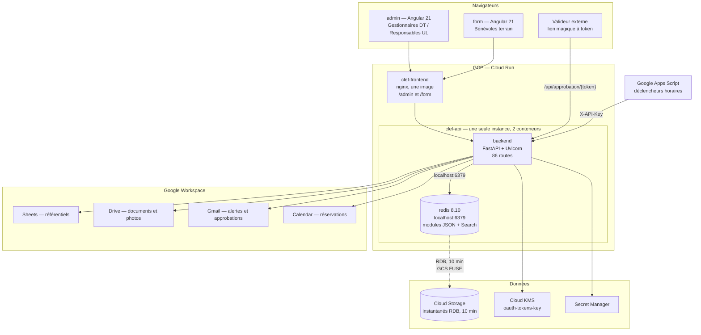

# Architecture CLEF — vue d'ensemble

> Reconstruit le 2026-08-13 depuis le code seul, après perte des notes de l'agent
> précédent. Les faits ci-dessous sont vérifiés par lecture du code ou par
> exécution ; toute déduction est marquée `(inferred — verify)`.

## 1. Composants



Frontière importante : `USE_MOCKS=true` remplace **la totalité** de la colonne
Google Workspace et l'OIDC par des doubles en mémoire (`backend/app/mocks/`).
C'est le mode utilisé par les tests et le développement local — aucune credential
requise.

## 2. Flux de données principaux

### Authentification

```
Navigateur → GET /auth/login → URL d'autorisation Google
           → callback Google → GET /auth/callback?code=…
           → 307 + Set-Cookie clef_session=<ID token Google brut>
           → chaque requête : get_current_user() revérifie le JWT
```

Points structurants :

- **Le cookie de session *est* l'ID token Google** (JWT), pas un identifiant de
  session opaque. Il n'existe **aucun store de session côté serveur** : le token
  est revérifié à chaque requête contre le JWKS de Google (RS256), avec
  contrôle du domaine `@croix-rouge.fr`. Cookie `httponly`, `samesite=lax`, 24 h.
- **Le rôle n'est pas dans le token.** Il est résolu à chaque requête par
  `AuthService` (`app/auth/service.py`) : (1) correspondance avec
  `EMAIL_GESTIONNAIRE_DT` → `Gestionnaire DT` ; (2) recherche dans le référentiel
  bénévoles via Google Sheets ; (3) repli sur le référentiel `responsables`
  (legacy) ; (4) défaut `Bénévole` sans périmètre.
- Le **super admin** est un email unique (`SUPER_ADMIN_EMAIL`), orthogonal au rôle.
- Les **gestionnaires DT** disposent en plus de tokens OAuth à scope étendu,
  chiffrés par KMS et stockés dans Redis (`dt_token_service.py`), pour agir sur
  Drive/Gmail/Calendar en leur nom.

### Prise de véhicule par un bénévole

```
form: scan QR → POST /api/vehicles/decode (HMAC, public)
    → PriseFormComponent : km, carburant, état, jusqu'à 5 photos, signature
    → POST /api/carnet-de-bord/prise
    → RedisService : entrée {DT}:carnet:{immat}:{ts}
                    + pointeur {DT}:carnet:derniere_prise:{immat}
    → puis second appel POST /api/upload/photos (photos sur Drive)
```

Trois pièges vérifiés sur ce flux, détaillés dans `docs/TODO.md` :

- **Le stockage est Redis uniquement.** `CarnetBordService`
  (`app/services/carnet_bord_service.py`), qui implémentait l'écriture dans un
  Google Sheet par périmètre, est **du code mort jamais importé** — le router
  écrit `spreadsheet_id=None,  # No longer using Google Sheets`
  (`app/routers/carnet_bord.py:78,148`).
- **L'identité du bénévole est codée en dur** (`'user@example.com'`) : toute entrée
  de carnet est mal attribuée.
- **Les noms de champs du formulaire de prise ne correspondent pas au modèle
  backend** (`nomSynthetique`/`kmDepart`/`emailBenevole` côté frontend contre
  `vehicule_id`/`kilometrage`/`benevole_email` côté Pydantic) : la soumission
  échouerait en 422. Sévérité haute.

### Approbation de devis par un valideur externe

```
Gestionnaire crée un devis → POST …/devis
    → ApprovalService génère un token (TTL 7 jours dans Redis)
    → EmailService envoie un lien magique au valideur
Valideur (non authentifié) → GET /api/approbation/{token}
    → POST /api/approbation/{token} avec sa décision
    → historique horodaté sur le dossier
```

C'est le seul chemin **volontairement public**, sécurisé par l'entropie du token.
La recherche du token fait un `SCAN` sur tout le keyspace en repli
(`app/routers/approbation.py:60`) car le DT n'est pas connu à l'avance.

## 3. Modèle de données Redis

**Convention unique et centrale** : `RedisService._key()` produit toujours
`f"{dt}:{...}"`. **Le code DT est le premier segment de chaque clé.** C'est le seul
mécanisme d'isolation multi-tenant, appliqué par l'application — Redis n'impose
rien. Le `dt` provient de `current_user.dt`.

| Motif de clé | Structure | Contenu |
|---|---|---|
| `{DT}:configuration` | JSON | configuration DT, URLs Sheets/Drive, clés API |
| `{DT}:unite_locale:{ul_id}` + `:index` | JSON + SET | unités locales |
| `{DT}:vehicules:{immat}` + `:index` | JSON + SET | référentiel véhicules |
| `{DT}:benevoles:{nivol}` + `:index` + `:by_ul:{ul}` | JSON + SET | bénévoles |
| `{DT}:carnet:{immat}:{ts}` + `:index` | JSON + SET | carnet de bord |
| `{DT}:reservations:{id}` + `:index` + `:by_date:{d}` + `:by_vehicle:{immat}` | JSON + SET ×3 | réservations et index d'accès |
| `{DT}:vehicules:{immat}:travaux:counter` | STRING (`INCR`) | séquence de numéro de dossier |
| `{DT}:vehicules:{immat}:travaux:{numero}` + `:index` + `:historique` | JSON + SET + JSON | dossier de réparation et piste d'audit |
| `…travaux:{numero}:devis:{id}` / `:factures:{id}` (+ compteurs) | JSON / STRING | devis et factures |
| `{DT}:fournisseurs:{id}`, `{DT}:valideurs:{id}`, `{DT}:contacts_cc:{id}` | JSON + SET | fournisseurs, valideurs, contacts en copie |
| `{DT}:approbation:{token}` | STRING | token d'approbation, **TTL 7 j** |
| `{DT}:oauth:dt_manager_tokens` | STRING | tokens OAuth chiffrés KMS, **sans TTL Redis** |
| `clef:calendar_ids:{nom}` | STRING | cache d'ID Calendar — ⚠️ **sans préfixe DT** |
| `clef:carnet_bord:sheet_id:{perimetre}:v{N}` | STRING | cache d'ID Sheet — ⚠️ **sans préfixe DT** |
| `ical:{dt}:all`, `ical:{dt}:vehicle:{immat}` | STRING | cache iCal, TTL 60 s — ordre de segments incohérent |

Trois écarts à la convention sont à connaître : les deux caches `clef:*` ne
portent **aucun** code DT (espace de noms global, isolation plus faible), et les
clés `ical:*` placent le DT en deuxième position.

Numérotation métier des dossiers : `REP-{YYYY}-{NNN}`
(`redis_service.py:1305-1307`), conforme à `docs/specs-gestion-factures.md`.

## 4. Modèle d'autorisation

| Rôle | Origine | Portée |
|---|---|---|
| `Gestionnaire DT` | `EMAIL_GESTIONNAIRE_DT` ou référentiel | toute la DT |
| `Responsable UL` | référentiel bénévoles | son unité locale |
| `Bénévole` | défaut | lecture selon filtre UL |
| super admin | `SUPER_ADMIN_EMAIL` | routes de debug uniquement |

Chaîne de garde (`app/auth/dependencies.py`) :

```
get_current_user          (lit le cookie, ne lève jamais)
  → require_authenticated_user      (401 si absent)
    → require_dt_manager / require_ul_responsible   (403 si rôle incompatible)
    → require_super_admin                            (403 sauf email exact)
```

`get_redis_service` dépend lui-même de `require_authenticated_user` : tout
endpoint qui injecte le service est donc authentifié transitivement.

**Faiblesses structurelles constatées** (détail et sévérité dans `docs/TODO.md`) :

- `app/main.py` ne contient **aucun `Depends`** et aucune dépendance globale ;
  trois routes y exposent des données personnelles sans authentification.
- Le paramètre de chemin `{dt}` n'est pas systématiquement recoupé avec le DT de
  l'appelant → risque d'accès transverse entre délégations.
- Les dossiers de réparation et les dépenses n'appliquent **pas** le filtre UL
  que `vehicles.py` applique, alors qu'ils exposent des données de véhicule.

## 5. Dépendances externes

| Système | Usage | Mode mock |
|---|---|---|
| Redis 8.10 (bundle) | stockage principal ; **modules JSON et Search requis** | `fakeredis[json]` |
| Google Sheets | référentiels véhicules / bénévoles / responsables. **Plus le carnet de bord** : ce chemin a été abandonné au profit de Redis, le service Sheets correspondant est du code mort | `google_sheets_mock.py` |
| Google Drive | documents et photos par véhicule, arborescence de dossiers | `google_drive_mock.py` |
| Gmail | alertes CT/pollution, demandes d'approbation | `google_gmail_mock.py` |
| Google Calendar | événements de réservation | `google_calendar_mock.py` |
| Cloud KMS | chiffrement des tokens OAuth des gestionnaires | base64 en mock |
| Secret Manager | secrets d'exécution en Cloud Run | `.env` en local |
| Google Apps Script | pousse les référentiels vers l'API par clé API | — |

Deux familles Drive/Gmail **coexistent** : l'une basée sur le service account
(`drive.py`, `gmail.py`, via une interface abstraite et une factory), l'autre sur
l'OAuth du gestionnaire DT (`drive_service.py`, `gmail_service.py`, avec mocks
inline). Le motif mock/réel est lui aussi dédoublé : factory d'un côté, branches
`if self.use_mocks:` de l'autre. `(inferred — verify)` : il s'agit vraisemblablement
d'une migration inachevée du service account vers l'OAuth délégué, mais le code
ne le dit pas et le *pourquoi* est perdu.

## 6. Topologie de déploiement

Tranchée le 2026-08-26 par
[ADR 0008](../adr/0008-redis-sidecar-cloud-run-instantanes-gcs.md). Procédure
opérationnelle dans `DEPLOYMENT.md`.

| Élément | Réalité |
|---|---|
| Images | 2 : `clef-api` (backend) et `clef-frontend` (nginx servant `/admin` et `/form` depuis **une seule** image), construites par Cloud Build |
| Exécution | Cloud Run, `europe-west1` |
| Données | **conteneur `redis` adjoint au backend**, dans la même instance, sur `localhost:6379`. Pas de service managé |
| Persistance | instantanés RDB vers un bucket Cloud Storage monté en FUSE. **RPO 10 min** |
| Dimensionnement | `maxScale = 1` **obligatoire** : une instance = un Redis. Deux instances feraient diverger deux jeux de données, en silence |
| Racine IaC | `deploy/terraform/`, state dans un bucket GCS versionné |
| Descripteur Cloud Run | `deploy/cloudrun-api.yaml.tpl`, appliqué par `gcloud run services replace` — `gcloud run deploy` ne sait décrire ni plusieurs conteneurs ni un volume GCS |
| Déclenchement | **manuel, depuis l'hôte** : `./00-infra.sh <env>` puis `./01-gcp-deploy.sh <env>`. La CI ne déploie plus |

⚠️ **Rien n'est déployé à ce jour.** Les scripts sont écrits et vérifiés
statiquement mais n'ont jamais tourné contre GCP (`docs/TODO.md` N7). Le projet
`rcq-fr-dev` est en outre **partagé** avec une autre application : secrets
préfixés `CLEF_`, APIs jamais désactivées à la destruction, liaisons IAM additives.

L'écart de région subsiste, mais il est désormais **délibéré et documenté** :
calcul, bucket et registre en `europe-west1` ; keyring KMS en `europe-west9`, où il
existait déjà et d'où un keyring ne se déplace pas. Sans conséquence — KMS n'est
appelé qu'à l'ouverture de session.

Les anciennes racines `backend/terraform/` et `infra/` subsistent le temps de
valider la nouvelle, puis seront supprimées (`docs/TODO.md` N12).
