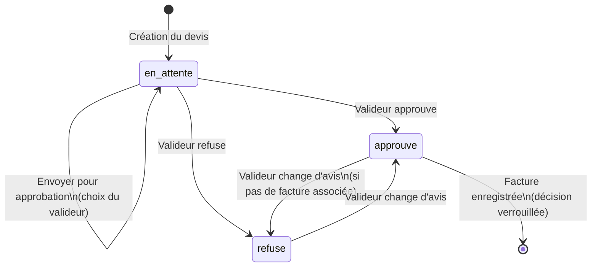
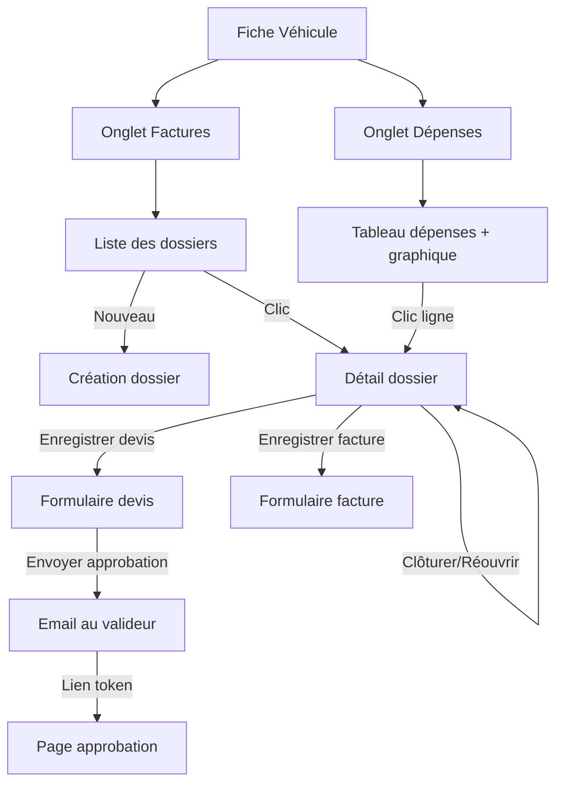

# Spécification — Module Gestion des Dossiers Réparations & Factures

**Application** : CLEF — Gestion de flotte (Croix-Rouge française)**Version** : 1.0**Date** : 2026-03-20**Stack technique** : FastAPI + Valkey (Redis JSON) · Angular 21 · Google Drive · Google OAuth

## 1. Vue d'ensemble

Le module "Dossiers Réparations & Factures" permet de gérer le cycle de vie des réparations véhicules :

- Création de dossiers réparations
- Gestion des devis avec workflow d'approbation
- Enregistrement des factures
- Suivi des dépenses par véhicule

## 2. Dossier Réparations

### 2.1 Accès

Nouvel onglet **"Factures"** dans la fiche véhicule (`vehicle-edit`).

### 2.2 Liste des dossiers

- Bouton **"Nouveau Dossier Réparation"** en haut
- Liste des dossiers triés par date de création (plus récent en premier)
- Chaque dossier affiche : N° dossier, description (tronquée), date, statut (ouvert/clôturé), nombre de devis/factures

### 2.3 Création d'un dossier

| Champ | Type | Obligatoire | Notes |
| --- | --- | --- | --- |
| Description | textarea | ✅ | — |
| Photos | upload multiple | ❌ | Upload vers Google Drive dans le dossier Factures du véhicule |
| N° de dossier | texte, readonly | auto | Format : REP-{YYYY}-{NNN} (ex : REP-2026-001). Compteur stocké dans Valkey à DT75:vehicules:IMMAT:travaux:counter |
| Date de création | date, readonly | auto | Date du jour |

> Futur — Bouton "Lier à un sinistre" : quand le module sinistre sera implémenté, un lien Google Drive sera créé vers le dossier travaux dans le répertoire du sinistre.

### 2.4 Stockage Valkey

- **Clé dossier** : `DT75:vehicules:IMMAT:travaux:REP-2026-001`
- **Index** : `DT75:vehicules:IMMAT:travaux:index` (SET des numéros de dossier)

### 2.5 Modèle de données — `DossierReparation`

```json
{
  "numero": "REP-2026-001",
  "immat": "AB-123-CD",
  "dt": "DT75",
  "description": "Remplacement plaquettes de frein + disques avant",
  "photos": [
    { "file_id": "...", "name": "...", "web_view_link": "..." }
  ],
  "sinistre_id": null,
  "statut": "ouvert",
  "cree_par": "thomas.manson@croix-rouge.fr",
  "cree_le": "2026-03-20T10:00:00Z",
  "cloture_le": null,
  "devis": [],
  "factures": []
}
```

> Valeurs de statut : ouvert | cloture | annule

### 2.6 Écran Dossier Réparation

Affiché après création ou clic sur un dossier existant.

- **En-tête** : N° dossier, date, statut, description
- **Boutons** : "Enregistrer un devis", "Enregistrer une facture"
- **Section devis** : liste des devis associés
- **Section factures** : liste des factures associées
- **Bouton** "Clôturer le dossier" / "Réouvrir le dossier"
- Quand clôturé → tout est en lecture seule, pas de nouveau devis/facture possible

## 3. Devis (Quotes)

> ⚠️ L'enregistrement d'un devis est optionnel mais recommandé.

### 3.1 Formulaire Devis

| Champ | Type | Obligatoire | Notes |
| --- | --- | --- | --- |
| Date du devis | date picker | ✅ | — |
| Fournisseur | composant Fournisseurs | ✅ | Voir section 5 |
| Description des travaux | textarea | ❌ | Pré-remplie depuis la description du dossier. Modifiable. |
| Montant du devis | number (€) | ✅ | — |
| Fichier devis | upload (PDF/image) | ❌ | Stocké dans Google Drive |

### 3.2 Modèle de données — `Devis`

```json
{
  "id": "uuid",
  "date_devis": "2026-03-20",
  "fournisseur": {
    "id": "uuid",
    "nom": "Garage Dupont",
    "adresse": "12 rue de la Paix, 75001 Paris",
    "telephone": "01 23 45 67 89",
    "siret": "123 456 789 00012",
    "email": "contact@garage-dupont.fr"
  },
  "description": "Remplacement plaquettes de frein",
  "montant": 450.00,
  "fichier": {
    "file_id": "...",
    "name": "devis-dupont.pdf",
    "web_view_link": "..."
  },
  "statut": "en_attente",
  "valideur_email": null,
  "valideur_commentaire": null,
  "token_approbation": null,
  "date_envoi_approbation": null,
  "date_decision": null,
  "cree_par": "thomas.manson@croix-rouge.fr",
  "cree_le": "2026-03-20T10:00:00Z"
}
```

> Valeurs de statut : en_attente | envoye | approuve | refuse | annule

### 3.3 Workflow d'approbation



**Étapes détaillées** :

1. Devis créé → statut `en_attente`
2. L'utilisateur clique **"Envoyer pour approbation"**
3. Choix du valideur parmi une liste définie au niveau UL (ou DT pour les véhicules DT)
4. Envoi d'un **email HTML** bien formaté contenant :
  - Toutes les données du devis (fournisseur, description, montant)
  - Lien vers le fichier Google Drive du devis
  - Lien unique pour approuver/refuser le devis (page dédiée)
5. L'approbateur se connecte avec son email Croix-Rouge (doit correspondre à un des approbateurs définis)
6. Il visualise les informations et clique **Approuver** ou **Refuser** (avec commentaire optionnel)
7. Il peut changer sa décision tant qu'une facture n'a pas été enregistrée pour ce devis
8. **Notification email** au demandeur quand la décision est prise

### 3.4 Page d'approbation

Route publique sécurisée par token.

- Affiche toutes les infos du devis en lecture seule
- Boutons **Approuver** / **Refuser**
- Champ commentaire optionnel
- **Authentification** : l'approbateur doit se connecter avec son email CRF qui doit correspondre au `valideur_email`

## 4. Factures (Invoices)

### 4.1 Enregistrement d'une facture

**Cas 1 — Depuis le dossier réparation (sans devis approuvé)** :

- ⚠️ Warning : *"Avant d'engager des frais, vous devez avoir un devis validé. Êtes-vous sûr de vouloir procéder sans devis validé ?"*
- Si **Oui** → ouvre le formulaire facture
- Si **Non** → ouvre l'ajout d'un devis

**Cas 2 — Depuis un devis approuvé** :

- Pas de warning, ouvre directement le formulaire facture
- Les champs sont pré-remplis depuis le devis (fournisseur, description, montant)

### 4.2 Formulaire Facture

| Champ | Type | Obligatoire | Notes |
| --- | --- | --- | --- |
| Date de la facture | date picker | ✅ | — |
| Fournisseur | composant Fournisseurs | ✅ | Voir section 5 |
| Classification comptable | select | ✅ | Voir valeurs ci-dessous |
| Description des travaux | textarea | ❌ | Pré-remplie depuis le devis si applicable |
| Montant total | number (€) | ✅ | — |
| Montant à charge CRF | number (€) | ✅ | Si sinistre, la CRF peut ne payer que la franchise |
| Fichier facture | upload (PDF/image) | ❌ | Stocké dans Google Drive |
| Devis associé | readonly | auto | Lien vers le devis si applicable |

**Valeurs de classification comptable** :

| Valeur technique | Libellé |
| --- | --- |
| entretien_courant | Entretien courant |
| reparation_carrosserie | Réparation carrosserie/mécanique |
| reparation_sanitaire | Réparation sanitaire |
| reparation_marquage | Réparation marquage |
| controle_technique | Contrôle technique |
| frais_duplicata_cg | Frais duplicata carte grise |
| autre | Autre |

### 4.3 Modèle de données — `Facture`

```json
{
  "id": "uuid",
  "date_facture": "2026-04-15",
  "fournisseur": {
    "id": "uuid",
    "nom": "Garage Dupont",
    "adresse": "12 rue de la Paix, 75001 Paris",
    "telephone": "01 23 45 67 89",
    "siret": "123 456 789 00012",
    "email": "contact@garage-dupont.fr"
  },
  "classification": "reparation_carrosserie",
  "description": "Remplacement plaquettes de frein + disques",
  "montant_total": 520.00,       // TTC (la CRF ne récupère pas la TVA)
  "montant_crf": 520.00,         // TTC
  "fichier": {
    "file_id": "...",
    "name": "facture-dupont.pdf",
    "web_view_link": "..."
  },
  "devis_id": "uuid-du-devis-associe",
  "cree_par": "thomas.manson@croix-rouge.fr",
  "cree_le": "2026-04-15T10:00:00Z"
}
```

> devis_id : null si aucun devis associé.

## 5. Fournisseurs (Suppliers)

### 5.1 Composant réutilisable

Affiché sous forme de **dropdown avec recherche** + bouton **"Ajouter un fournisseur"**.

### 5.2 Scope des fournisseurs

- Chaque **DT** a sa propre liste de fournisseurs
- Chaque **UL** a sa propre liste de fournisseurs
- Il peut y avoir des doublons entre DT et UL (c'est normal)
- L'utilisateur voit les fournisseurs de **son UL + ceux de la DT**

### 5.3 Stockage Valkey

| Niveau | Index (SET) | Données (JSON) |
| --- | --- | --- |
| DT | DT75:fournisseurs:index | DT75:fournisseurs:{id} |
| UL | DT75:fournisseurs:UL_{ul_id}:index | DT75:fournisseurs:UL_{ul_id}:{id} |

### 5.4 Modèle de données — `Fournisseur`

```json
{
  "id": "uuid",
  "nom": "Garage Dupont",
  "adresse": "12 rue de la Paix, 75001 Paris",
  "telephone": "01 23 45 67 89",
  "siret": "123 456 789 00012",
  "email": "contact@garage-dupont.fr",
  "contact_nom": "Pierre Dupont",
  "specialites": ["mécanique", "carrosserie"],
  "niveau": "ul",
  "ul_id": "ul-paris-15",
  "cree_par": "thomas.manson@croix-rouge.fr",
  "cree_le": "2026-01-15T10:00:00Z"
}
```

> Valeurs de niveau : dt | ulul_id : null si niveau = dt

## 6. Onglet Dépenses

Nouvel onglet dans la fiche véhicule, à côté de l'onglet "Factures".

### 6.1 Contenu

- **En-tête par année** : nombre de dossiers, total "coût total", total "coût CRF"
- **Graphique** : accumulation des coûts par an (repart à 0 chaque 1er janvier)
- **Tableau** groupé par année :

| Date | N° Dossier | Coût Total | Coût CRF |
| --- | --- | --- | --- |
| 2026 — 3 dossiers — Total : 1 520,00 € — CRF : 1 200,00 € |  |  |  |
| 15/04/2026 | REP-2026-003 | 520,00 € | 520,00 € |
| 01/03/2026 | REP-2026-002 | 350,00 € | 350,00 € |
| 15/01/2026 | REP-2026-001 | 650,00 € | 330,00 € |
| 2025 — 2 dossiers — Total : 800,00 € — CRF : 800,00 € |  |  |  |
| ... |  |  |  |

- Clic sur une ligne → ouvre le dossier réparation correspondant

## 7. Analyse & Points d'attention

### 7.1 Upload des fichiers devis/factures

Les scans PDF/photos des devis et factures sont stockés dans Google Drive, dans le sous-dossier `Factures` du véhicule.

**Structure** :

- `{Véhicule}/Factures/{REP-2026-001}/devis-fournisseur.pdf`
- `{Véhicule}/Factures/{REP-2026-001}/facture-fournisseur.pdf`

### 7.2 Permissions

| Action | Qui peut ? |
| --- | --- |
| Création dossier/devis/facture | Tout utilisateur ayant accès au véhicule |
| Approbation devis | Uniquement les valideurs définis (niveau UL ou DT) |
| Clôture dossier | Créateur du dossier ou gestionnaire DT |
| Gérer les fournisseurs UL | Responsable véhicule de l'UL |
| Gérer les fournisseurs DT | Responsable DT |

### 7.3 Édition

- Un devis/facture **peut être modifié** tant que le dossier n'est pas clôturé.
- Un devis **approuvé n'est pas modifiable** (sauf le valideur qui peut changer sa décision tant qu'une facture n'a pas été enregistrée).

### 7.4 Suppression / Annulation

- **Pas de suppression physique** pour l'audit trail.
- Un statut **"annulé"** est disponible sur le devis et le dossier de réparation.
- Valeurs de statut dossier : `ouvert` | `cloture` | `annule`
- Valeurs de statut devis : `en_attente` | `envoye` | `approuve` | `refuse` | `annule`

### 7.5 Multi-fournisseurs par dossier

- Un **fournisseur par devis/facture**, mais un dossier peut avoir **plusieurs devis/factures** avec des fournisseurs différents.
- Cela permet la mise en concurrence (plusieurs devis) et la répartition des travaux (plusieurs factures).

### 7.6 Lien devis ↔ facture

- Un devis peut avoir **une seule facture** associée.
- Un dossier peut avoir des **factures sans devis**.

### 7.7 Notifications / Rappels

- ✅ Email au demandeur quand le devis est approuvé/refusé.
- ✅ **Rappel automatique** : délai paramétrable au niveau de la configuration de l'UL. Un rappel email est envoyé si un devis n'a pas été traité (approuvé/refusé) après le délai configuré.

### 7.8 Historique / Audit trail

Chaque dossier a un historique stocké dans Valkey à `{DT}:vehicules:{IMMAT}:travaux:{N°DOSSIER}:historique`.

**Format** : array JSON d'entrées :

```json
[
  {
    "date": "2026-03-20T14:30:00Z",
    "auteur": "thomas.manson@croix-rouge.fr",
    "action": "creation",
    "details": "Dossier créé",
    "ref": "DT75:vehicules:AB-123-CD:travaux:REP-2026-001"
  },
  {
    "date": "2026-03-20T15:00:00Z",
    "auteur": "thomas.manson@croix-rouge.fr",
    "action": "devis_ajoute",
    "details": "Devis #1 - Garage Martin - 850€",
    "ref": "DT75:vehicules:AB-123-CD:travaux:REP-2026-001:devis:1"
  },
  {
    "date": "2026-03-21T09:00:00Z",
    "auteur": "chef.ul15@croix-rouge.fr",
    "action": "devis_approuve",
    "details": "Devis #1 approuvé",
    "ref": "DT75:vehicules:AB-123-CD:travaux:REP-2026-001:devis:1"
  },
  {
    "date": "2026-03-25T16:00:00Z",
    "auteur": "thomas.manson@croix-rouge.fr",
    "action": "facture_ajoutee",
    "details": "Facture #1 - Garage Martin - 920€ TTC",
    "ref": "DT75:vehicules:AB-123-CD:travaux:REP-2026-001:factures:1"
  },
  {
    "date": "2026-04-01T10:00:00Z",
    "auteur": "thomas.manson@croix-rouge.fr",
    "action": "cloture",
    "details": "Dossier clôturé",
    "ref": "DT75:vehicules:AB-123-CD:travaux:REP-2026-001"
  }
]
```

Le champ `ref` pointe vers la clé Valkey de l'objet concerné.

**Actions tracées** : `creation`, `modification`, `devis_ajoute`, `devis_modifie`, `devis_annule`, `devis_envoye_approbation`, `devis_approuve`, `devis_refuse`, `facture_ajoutee`, `facture_modifiee`, `cloture`, `reouverture`, `annulation`.

Affiché comme un **timeline** dans le détail du dossier.

### 7.9 Valideurs

Liste des valideurs configurée au niveau de la **configuration de l'UL** ou du **DT** (pour les véhicules DT). Géré dans l'écran de configuration existant.

### 7.10 Token d'approbation

Le lien d'approbation par email doit utiliser un **token sécurisé** (JWT ou UUID unique) avec expiration.

### 7.11 TVA

Toutes les factures sont en **TTC** (la Croix-Rouge ne récupère pas la TVA). Pas de champ HT/TVA séparé. Les champs `montant_total` et `montant_crf` du modèle Facture sont en TTC.

### 7.12 Devise

**EUR uniquement** (France métropolitaine + DOM-TOM).

### 7.13 Export

✅ Export **CSV** et **PDF** des dépenses disponible depuis l'onglet Dépenses.

### 7.14 Mobile

Les utilisateurs terrain utilisent des smartphones. Le formulaire de création de dossier (avec photos) doit être **mobile-friendly**.

### 7.15 Écart devis / facture

Le montant de la facture peut être différent du devis.

✅ **Warning non bloquant** affiché si l'écart entre le montant du devis et le montant de la facture dépasse **20%**.

## 8. Google Drive — Structure des dossiers

```
{DT Root Drive Folder}/
└── Véhicules/
    └── {UL}/
        └── {nom_synthetique}/
            └── Factures/
                ├── REP-2026-001/
                │   ├── photos/
                │   │   ├── photo1.jpg
                │   │   └── photo2.jpg
                │   ├── devis-garage-dupont.pdf
                │   └── facture-garage-dupont.pdf
                └── REP-2026-002/
                    └── ...
```

## 9. API Endpoints (Backend)

### 9.1 Dossiers Réparations

| Méthode | Endpoint | Description |
| --- | --- | --- |
| POST | /api/{dt}/vehicles/{immat}/dossiers-reparation | Créer un dossier |
| GET | /api/{dt}/vehicles/{immat}/dossiers-reparation | Lister les dossiers |
| GET | /api/{dt}/vehicles/{immat}/dossiers-reparation/{numero} | Détails d'un dossier |
| PATCH | /api/{dt}/vehicles/{immat}/dossiers-reparation/{numero} | Modifier (clôturer/réouvrir) |

### 9.2 Devis

| Méthode | Endpoint | Description |
| --- | --- | --- |
| POST | /api/{dt}/vehicles/{immat}/dossiers-reparation/{numero}/devis | Ajouter un devis |
| GET | /api/{dt}/vehicles/{immat}/dossiers-reparation/{numero}/devis/{id} | Détails devis |
| POST | /api/{dt}/vehicles/{immat}/dossiers-reparation/{numero}/devis/{id}/envoyer-approbation | Envoyer pour approbation |

### 9.3 Approbation (route avec token)

| Méthode | Endpoint | Description |
| --- | --- | --- |
| GET | /api/approbation/{token} | Afficher la page d'approbation |
| POST | /api/approbation/{token} | Soumettre la décision |

### 9.4 Factures

| Méthode | Endpoint | Description |
| --- | --- | --- |
| POST | /api/{dt}/vehicles/{immat}/dossiers-reparation/{numero}/factures | Ajouter une facture |
| GET | /api/{dt}/vehicles/{immat}/dossiers-reparation/{numero}/factures/{id} | Détails facture |

### 9.5 Dépenses (agrégation)

| Méthode | Endpoint | Description |
| --- | --- | --- |
| GET | /api/{dt}/vehicles/{immat}/depenses | Données du tableau dépenses |

### 9.6 Fournisseurs

| Méthode | Endpoint | Description |
| --- | --- | --- |
| GET | /api/{dt}/fournisseurs | Lister (DT + UL de l'utilisateur) |
| POST | /api/{dt}/fournisseurs | Ajouter un fournisseur |
| PATCH | /api/{dt}/fournisseurs/{id} | Modifier un fournisseur |

## 10. Composants Frontend (Angular)

### 10.1 Arborescence proposée

```
frontend/projects/admin/src/app/vehicles/
├── vehicle-edit/
│   └── (onglet Factures existant → enrichi)
├── dossier-reparation/
│   ├── dossier-list/                    # Liste des dossiers
│   ├── dossier-detail/                  # Détail d'un dossier
│   ├── dossier-create/                  # Formulaire création
│   ├── devis-form/                      # Formulaire devis
│   ├── facture-form/                    # Formulaire facture
│   └── depenses-tab/                    # Onglet dépenses avec graphique
├── shared/
│   └── fournisseur-selector/            # Composant réutilisable fournisseurs
└── approbation/
    └── approbation-page/                # Page publique d'approbation
```

### 10.2 Diagramme de navigation

