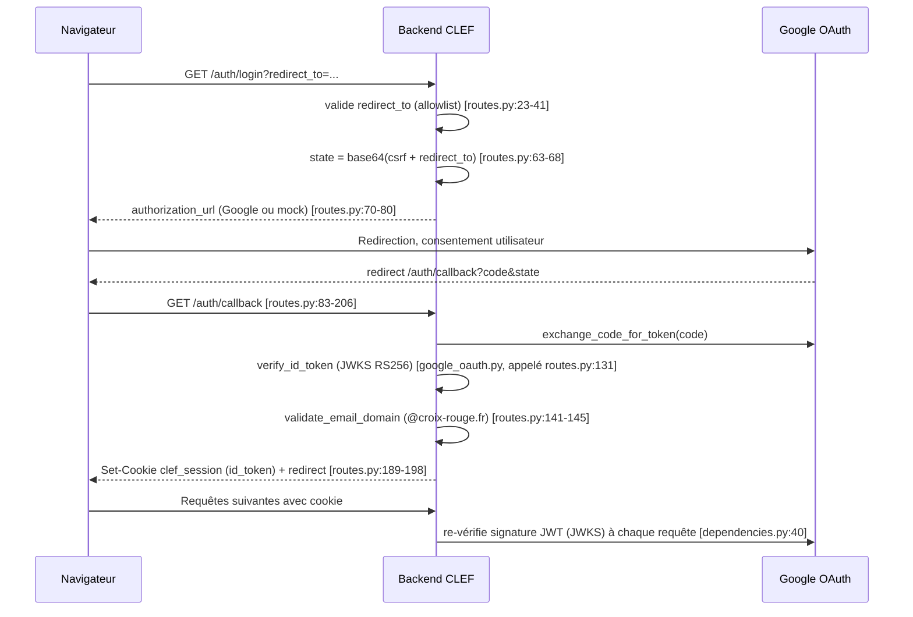

# Authentification & rôles — CLEF

> ⚠️ **La section « Rôles et résolution » de ce document est périmée depuis le
> 2026-08-21.** Elle décrit une résolution par lecture Google Sheets, puis par un champ
> `role` à valeur unique. Depuis les tâches N2 et le chantier « référentiel bénévoles » :
> le référentiel est lu dans **Redis** via l'index `benevoles:by_email`, et le rôle est
> **dérivé** de `fonctions_dt` puis `responsable_ul` — un `statut` `inactif` refusant
> l'accès. Voir `docs/specs/synchronisation-referentiel-benevoles.md` et
> [ADR 0007](../adr/0007-partage-de-propriete-feuille-clef.md). Le reste du document
> (flux OAuth, cookie, super admin) demeure exact.

Spec agent-facing reconstruite à partir du code (pas de doc source antérieure).
Portée : `backend/app/auth/*`, `backend/app/mocks/okta_mock.py`, garde-fous frontend admin.

## Objet

CLEF authentifie via Google OAuth2 (SSO), restreint au domaine `@croix-rouge.fr`.
Il n'existe **aucun magasin de session côté serveur** : le cookie `clef_session`
est l'ID token Google brut (JWT RS256), revérifié contre le JWKS Google à
**chaque requête**. Le rôle applicatif n'est jamais dans le token : il est
résolu à la volée depuis un référentiel Google Sheets (bénévoles), avec repli
sur un référentiel legacy (`responsables`).

## Flux OAuth

Cas particulier : si l'utilisateur == `SUPER_ADMIN_EMAIL`, le callback peut
rediriger vers un second consentement Google (scopes Calendar/Drive/Gmail)
avant d'atteindre le frontend (`routes.py:150-182`).

## Rôles et résolution

Rôles possibles : `Gestionnaire DT`, `Responsable UL`, `Bénévole` (défaut).
`Super admin` n'est **pas** un rôle : c'est un email unique (`SUPER_ADMIN_EMAIL`,
`config.py:42`), orthogonal, vérifié par `user_is_super_admin`
(`dependencies.py:134-138`).

Résolution par `AuthService.get_user_from_token` (`service.py:17-99`), dans
cet ordre de priorité :

1. `email == EMAIL_GESTIONNAIRE_DT` (hardcodé, `config.py:39`) → `Gestionnaire DT`,
   `dt="DT75"`, `perimetre="DT Paris"` (`service.py:34-44`).
2. Sinon, lookup bénévole via `sheets_service.get_benevole_by_email`
   (`service.py:47`, `101-106`) : le champ `benevole.role` mappe
   `responsable_dt`→`Gestionnaire DT`, `responsable_ul`→`Responsable UL`,
   sinon `Bénévole` (`service.py:50-63`).
3. Sinon, repli référentiel legacy `responsables`
   (`service.py:76`, `108-117`) : rôle = `responsable.role` ou défaut
   `"Responsable"` (chaîne libre, pas garantie être une des 3 valeurs ci-dessus)
   `(inferred — verify)`.
4. Sinon, utilisateur inconnu → `Bénévole`, `dt/ul=None` (`service.py:90-99`).

## Chaîne de gardes

Backend (`dependencies.py`), empilement de `Depends` :

`get_current_user` (peut renvoyer `None`, avale toutes les exceptions)
→ `require_authenticated_user` (401 si `None`, `:64-85`)
→ `require_dt_manager` (403 si rôle ≠ `Gestionnaire DT`, `:88-108`)
→ `require_ul_responsible` (403 si rôle pas dans `{Responsable UL, Gestionnaire DT}`,
  via `AuthService.is_ul_responsible`, `service.py:123-125`)
→ `require_super_admin` (403 si email ≠ `SUPER_ADMIN_EMAIL`, `:141-155`).

Alias : `is_authenticated`, `is_dt_manager`, `is_ul_responsible` (`:158-161`).

Frontend admin (`guards/*.ts`), tous `CanActivateFn` basés sur
`AuthService.getCurrentUser()` :

- `authGuard` (`core/guards/auth.guard.ts`) : authentifié seulement.
- `dtManagerGuard` (`guards/dt-manager.guard.ts`) : `isDTManager(user)`.
- `ulResponsableGuard` (`guards/ul-responsable.guard.ts:14`) : `isUlResponsable(user)
  && !isDTManager(user)` — **exclut explicitement** le Gestionnaire DT.
- `superAdminGuard` (`guards/super-admin.guard.ts`) : `isSuperAdmin(user)`.

**Incohérence backend/frontend** : `require_ul_responsible` backend **inclut**
`Gestionnaire DT` (`service.py:123-125`), alors que `ulResponsableGuard`
frontend l'**exclut** (`ul-responsable.guard.ts:14`) `(inferred — verify)`.
Un Gestionnaire DT peut donc passer une garde API mais être bloqué côté route
Angular équivalente, ou inversement selon l'implémentation exacte du service.

## Mode mock

Activé par `USE_MOCKS=true` (`config.py:52`). Remplace Google par
`backend/app/mocks/okta_mock.py` (classe `OktaMock`, instance partagée
`mock_instance.okta_mock`) :

- 4 utilisateurs codés en dur (`okta_mock.py:16-45`).
- JWT **HS256** signé avec un secret statique `mock-secret-key-for-testing`
  (`:15`, `:135`), sans vérification JWKS.
- `/auth/mock-login` génère un code d'autorisation factice (`routes.py:254-282`).
- **La validation de domaine `@croix-rouge.fr` est sautée en mode mock**
  (`dependencies.py:35-38` vs `:42-45` ; `routes.py:110-117` vs `:141-145`).
- Bug historique corrigé : `datetime.utcnow()` naïf faisait dériver `iat/exp`
  de l'offset fuseau (échec en CEST) ; fixé via `datetime.now(timezone.utc)`
  (`okta_mock.py:121-131`, commentaire en français dans le code).

## Entrées / sorties

| Endpoint | Méthode | Garde | Rôle requis |
|---|---|---|---|
| `/auth/login` | GET | aucune | — |
| `/auth/callback` | GET | aucune | — (valide domaine) |
| `/auth/logout` | POST | aucune | — |
| `/auth/me` | GET | `get_current_user` | authentifié (401 sinon) |
| `/auth/mock-login` | GET | `use_mocks` only | — |
| `/auth/authorize-dt` | GET | `require_dt_manager` | `Gestionnaire DT` |
| `/auth/callback-dt` | GET | aucune (state = email) | — |
| `/auth/dt-authorization-status` | GET | `require_dt_manager` | `Gestionnaire DT` |
| `/auth/revoke-dt-authorization` | POST | `require_dt_manager` | `Gestionnaire DT` |
| `/api/ul/{ul_id}/...` | GET/POST | `require_authenticated_user` + `_ensure_ul_access` | `Responsable UL` **exact** (`ul_config.py:73`) |

## Règles métier

1. Le cookie `clef_session` est l'ID token Google brut, revérifié à chaque
   requête (JWKS RS256), aucun état de session serveur.
2. Domaine `@croix-rouge.fr` obligatoire en production, sauté en mode mock.
3. `EMAIL_GESTIONNAIRE_DT` a priorité absolue sur le référentiel bénévoles.
4. Ordre de résolution rôle : DT manager hardcodé > bénévole > responsable
   legacy > défaut `Bénévole`.
5. `is_ul_responsible` (backend) inclut `Gestionnaire DT`.
6. `Super admin` est un email isolé, orthogonal au système de rôles.
7. Cookie `httponly`, `samesite=lax`, durée 24 h (`session_max_age`,
   `config.py:49`) ; `secure=False` en dur dans le code (`routes.py:178,194,224`)
   `(inferred — verify)` : à confirmer pour la prod HTTPS.
8. `redirect_to` (login) validé contre `ALLOWED_FRONTEND_URLS` (`routes.py:23-41`).
9. Flux séparé pour le Gestionnaire DT : scopes étendus (Calendar/Drive/Gmail),
   refresh token stocké chiffré via `dt_token_service` (`routes.py:311-360`).
10. `ul_config.py` exige le rôle **exact** `"Responsable UL"` — un
    `Gestionnaire DT` en est donc exclu malgré la règle 5 ci-dessus.

## Cas limites

- Cookie absent → `get_current_user` renvoie `None` → 401 sur route protégée.
- Toute exception de vérification (signature invalide, JWKS injoignable,
  parsing) → `None` silencieux, **aucun log** (`dependencies.py:60-61`).
- Email hors domaine : `None` silencieux en usage courant (`get_current_user`),
  mais 403 explicite si détecté dans `/auth/callback` (`routes.py:141-145`).
- Utilisateur authentifié mais absent des deux référentiels → `Bénévole` par
  défaut, `dt`/`ul` = `None` : accès minimal mais pas de rejet `(inferred — verify)`.
- Code d'autorisation invalide sur `/auth/callback` → lève `UnboundLocalError`
  (shadowing de `status` en branche non-mock), constaté par `test_auth.py:123-132`.
- Connexion du super admin → redirection intermédiaire vers un second
  consentement Google avant d'atteindre le frontend si non déjà autorisé.

## Critères d'acceptation

| Critère | Test |
|---|---|
| `/auth/login` renvoie une URL d'autorisation | `test_auth.py:23-29` |
| `/auth/me` sans cookie → 401 | `test_auth.py:31-35` |
| `/auth/logout` → 200 | `test_auth.py:37-41` |
| Flux complet → rôle `Gestionnaire DT` | `test_auth.py:43-80` |
| Flux complet → rôle `Responsable UL` | `test_auth.py:82-101` |
| Flux complet → rôle `Bénévole` | `test_auth.py:103-121` |
| Code d'autorisation invalide → erreur (bug connu) | `test_auth.py:123-132` |
| `require_authenticated_user` : 401 puis 200 | `test_auth.py:150-172` |
| `require_dt_manager` : 403 puis 200 | `test_auth.py:174-197` |
| `require_ul_responsible` : 403, puis 200 (UL et DT) | `test_auth.py:199-225` |
| Résolution rôle via `AuthService` (3 rôles) | `test_auth.py:231-286` |
| `require_super_admin` | **NON COUVERT** |
| `/auth/authorize-dt`, `/callback-dt`, `/dt-authorization-status`, `/revoke-dt-authorization` | **NON COUVERT** |
| Vérification JWKS réelle (RS256, mode production) | **NON COUVERT** (tests forcent `use_mocks=True`) |
| Garde exacte `"Responsable UL"` de `ul_config.py` | **NON COUVERT** |
| Guards frontend (`*.guard.ts`) | **NON COUVERT** côté backend ; un seul spec Angular trouvé (`super-admin.guard.spec.ts`), non lu ici |

## Écarts connus

1. `dependencies.py:60-61` avale **toute** exception (`except Exception: return
   None`) : toute erreur de vérification devient un 401 muet, sans log. C'est
   ce qui a masqué pendant des mois un bug de fuseau horaire faisant échouer
   86 tests (cf. correctif documenté dans `okta_mock.py:121-124`).
2. `backend/app/mocks/okta_mock.py` porte encore le nom « okta » alors que
   l'auth est passée à Google OAuth : le changement Okta→Google fut un
   renommage **cosmétique** (variables d'env + 2 libellés HTML), pas une
   réécriture du mock.
3. `backend/app/routers/ul_config.py:73` exige le rôle exactement
   `"Responsable UL"` : un `Gestionnaire DT` est donc **rejeté** des endpoints
   de config UL, alors que partout ailleurs (`service.py:123-125`) le
   Gestionnaire DT hérite des droits UL responsable — vraisemblablement un
   bug d'accès trop restrictif `(inferred — verify)`.
4. Aucune révocation de session possible côté CLEF (conséquence de l'absence
   de magasin) : `POST /auth/logout` ne peut que supprimer le cookie ; un
   token volé reste valide jusqu'à son expiration Google (24 h côté cookie,
   potentiellement plus côté JWT lui-même) `(inferred — verify)`.
5. Garde frontend `ulResponsableGuard` exclut le `Gestionnaire DT`
   (`ul-responsable.guard.ts:14`), incohérent avec la règle backend
   `is_ul_responsible` qui l'inclut — sens de la divergence non tranché sans
   lire `AuthService` Angular (`isUlResponsable`/`isDTManager`)
   `(inferred — verify)`.
