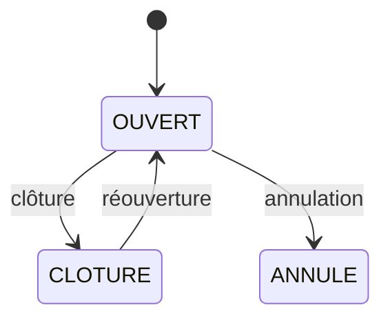

# Spec — Dossiers de réparation, devis, factures, sinistre et franchise

> Reconstruit le 2026-08-13 depuis le code et les tests seuls. Déductions marquées
> `(inferred — verify)`.
>
> **Ce document complète, il ne remplace pas, `docs/specs-gestion-factures.md`** —
> spec fonctionnel authentique de 530 lignes écrit par l'auteur d'origine le
> 2026-03-21, *avant* l'implémentation, et enrichi de la résolution de ses questions
> ouvertes (`ee66eb9`). En cas de divergence entre les deux, ce fichier décrit le
> **code tel qu'il est** et signale l'écart ; l'autre décrit **l'intention**.

## Objet

Suivre les travaux sur un véhicule : ouverture d'un dossier, collecte de devis
fournisseurs, approbation par des valideurs, enregistrement des factures, et suivi
des dépenses. L'extension **sinistre / franchise** distingue ce que paie la
Croix-Rouge de ce qui relève de l'assurance — c'est le travail en cours sur la
branche `feat/sinistres-franchise`.

## Modèle de données

### Entités

`DossierReparation` (`backend/app/models/repair_models.py`) :

| Champ | Type | Note |
|---|---|---|
| `numero` | `str` | `REP-{YYYY}-{NNN}`, séquence par véhicule (`valkey_service.py:1305-1307`) |
| `immat`, `dt` | `str` | véhicule et délégation |
| `titre` | `Optional[str]` | 50 caractères max |
| `description` | `List[str]` | liste d'items, **min 1 à la création** |
| `commentaire` | `Optional[str]` | libre |
| **`est_sinistre`** | `bool` = `False` | dossier dans le cadre d'un sinistre |
| **`franchise_applicable`** | `bool` = `False` | la franchise est-elle due |
| `photos` | `List[FichierDrive]` | |
| `sinistre_id` | `Optional[str]` | ⚠️ déclaré « futur » (`:168`), **jamais écrit ni lu** |
| `statut` | `StatutDossier` | défaut `OUVERT` |
| `historique` | tableau JSON | piste d'audit horodatée |

`Devis` et `Facture` portent fournisseur, classification comptable,
`description_items`, `montant_total` et `montant_crf` (part Croix-Rouge).
`Devis.token_approbation` (`:125`) porte le token d'approbation — voir Écarts.

### Clés Valkey

```
{DT}:vehicules:{immat}:travaux:counter                 STRING  (INCR)
{DT}:vehicules:{immat}:travaux:{numero}                JSON    le dossier
{DT}:vehicules:{immat}:travaux:index                   SET
{DT}:vehicules:{immat}:travaux:{numero}:historique     JSON    tableau d'audit
{DT}:vehicules:{immat}:travaux:{numero}:devis:counter  STRING
{DT}:vehicules:{immat}:travaux:{numero}:devis:{id}     JSON
{DT}:vehicules:{immat}:travaux:{numero}:factures:{id}  JSON
```

Le montant de franchise ne vit **pas** sur le dossier : il est porté par
`DTConfiguration.montant_franchise` (`valkey_models.py:34`, défaut `350.0`) et lu au
moment du besoin (`dossiers_reparation.py:423,540`, `approbation.py:101`).

## Machine à états



Les statuts de devis et de facture incluent `annule`, ajouté en réponse à la
question ouverte §7.4 du spec d'origine.

## Entrées / sorties

Préfixe : `/api/{dt}/vehicles/{immat}/dossiers-reparation`. Garde commune :
`require_authenticated_user` (16 endpoints, `routers/dossiers_reparation.py`).

| Méthode | Chemin (suffixe) | Corps | Réponse |
|---|---|---|---|
| `POST` | `` | `DossierReparationCreate` | `DossierReparation` |
| `GET` | `` | — | `DossierReparationListResponse` |
| `GET` | `/{numero}` | — | `DossierReparation` |
| `PATCH` | `/{numero}` | `DossierReparationUpdate` | `DossierReparation` |
| `POST` | `/{numero}/devis` | création de devis | `Devis` |
| `PATCH` | `/{numero}/devis/{devis_id}` | modification | `Devis` |
| `POST` | `/{numero}/devis/{devis_id}/upload` | fichier | `FichierDrive` |
| `POST` | `/{numero}/factures` | `FactureCreate` | `FactureResponse` |
| `PATCH` | `/{numero}/factures/{facture_id}` | `FactureUpdate` | `Facture` |
| `POST` | `/{numero}/approbation` | envoi groupé | statut d'envoi |

`FactureResponse` **hérite de `Facture`** depuis `ad4b7e2` : tous les champs de la
facture sont **au premier niveau**, à côté des drapeaux d'avertissement
`warning_no_devis`, `warning_devis_not_approved`, `warning_ecart`. C'était auparavant
un objet enveloppant (`{facture: {...}, warnings}`) — rupture de contrat à connaître
si du code client n'a pas suivi.

## Règles métier

1. `description` exige **au moins un item** à la création (`min_length=1`).
2. `titre` est limité à 50 caractères.
3. Le numéro de dossier suit `REP-{YYYY}-{NNN}`, la séquence étant tenue par un
   compteur `INCR` **par véhicule**.
4. Toute mutation ajoute une entrée horodatée à `historique`, avec un vocabulaire
   d'actions fixe (réponse à la question ouverte §7.8).
5. Les montants sont **TTC uniquement** : aucune gestion HT/TVA (arbitrage explicite
   du spec d'origine §7.11).
6. Un écart de plus de **20 %** entre devis et facture lève
   `warning_ecart` — avertissement **non bloquant** (§7.15).
7. Une facture sans devis approuvé lève `warning_no_devis` ; une facture rattachée à
   un devis non approuvé lève `warning_devis_not_approved`.
8. Un devis approuvé reste modifiable **jusqu'à l'enregistrement d'une facture**
   (§7.3).
9. `montant_crf` porte la part Croix-Rouge. Lorsque `est_sinistre` et
   `franchise_applicable` sont vrais, le coût CRF attendu est le montant de
   franchise : `cout_crf = montant_franchise if franchise_applicable else 0`
   (`email_service.py:270`).
10. La ventilation sinistre/franchise est rendue dans l'email d'approbation par
    `EmailService._build_cost_html` et sur la page d'approbation.

## Cas limites

**Traités** : dossier inexistant → 404 ; véhicule inexistant → 404 ; annulation de
devis ; réouverture d'un dossier clôturé ; devis multiples avec décision partielle ;
relance d'approbation avec invalidation de l'ancien token.

**Non traités** : aucune atomicité entre le compteur, le document et l'index — une
écriture partielle laisse un index désynchronisé et rien ne le détecte (conséquence
de l'[ADR 0001](../adr/0001-valkey-8-comme-datastore-principal.md)). Aucune
pagination sur la liste des dossiers.

## Critères d'acceptation

| Critère | Test |
|---|---|
| Création, lecture, mise à jour de dossier | `test_dossiers_reparation_api.py` |
| Numérotation `REP-{YYYY}-{NNN}` | `test_dossiers_reparation_api.py` |
| Piste d'audit alimentée | `test_audit_trail.py` |
| Devis : création, modification, annulation | `test_devis_factures_api.py` |
| Facture : création et avertissements | `test_devis_factures_api.py` |
| Dépenses et export | `test_depenses_api.py` |
| Champs du modèle, dont `est_sinistre`/`franchise_applicable` | `test_repair_models.py` |
| Approbation multi-devis, décision partielle | `test_approbation_api.py` |
| Parcours complet dossier (UI) | `frontend/e2e/admin-dossier-reparation.spec.ts` ⚠️ jamais exécuté en CI |
| **`PATCH .../factures/{facture_id}`** | **NON COUVERT** |
| **Ventilation de coût sinistre/franchise dans l'email** | **NON COUVERT** |
| **Relance avec invalidation de token** | **NON COUVERT** |
| **Enregistrement du `montant_franchise` via l'API de config** | **NON COUVERT** — et cassé, voir E1 |

## Écarts connus

| # | Écart | Sévérité |
|---|---|---|
| **E1** | **Le `montant_franchise` n'est ni enregistrable ni relisible.** Il est stocké (`valkey_models.py:34`) et consommé (`dossiers_reparation.py:423,540`, `approbation.py:101`), et l'écran Configuration propose un champ de saisie ; mais il est **absent de `ConfigUpdate` et de `ConfigResponse`** (`backend/app/models/config.py` — vérifié : une seule classe de chaque, aucune ne le déclare). `PATCH /api/config` le jette via `model_dump(exclude_none=True)` (`routers/config.py:128`) et l'UI ne peut jamais relire la valeur stockée. **La franchise est figée à 350 € pour toutes les délégations**, malgré une interface qui suggère le contraire. | 🟠 haute |
| **E2** | **`sinistre_id` est un champ mort** (`repair_models.py:168`). Jamais écrit, jamais lu — seule une assertion de test constate qu'il vaut `None`. La fonctionnalité a finalement été portée par deux booléens. Aucune trace de la raison de cet abandon. | 🟡 moyenne |
| **E3** | **`PATCH .../factures/{facture_id}` n'a aucun test backend**, alors que le chemin est câblé de bout en bout (`repair.service.ts` → `facture-form.component.ts:303`). | 🟡 moyenne |
| **E4** | **`Devis.token_approbation` n'est pas exclu du `response_model`** : des tokens d'approbation actifs sont renvoyés dans le JSON servi aux clients admin. | 🟠 haute |
| **E5** | **`warning_devis_not_approved` n'est jamais affiché** : le modèle frontend `FactureCreateResponse` (`repair.model.ts:153-157`) ne déclare que `warning_no_devis` et `warning_ecart`. L'avertissement backend est perdu en route. | 🟡 moyenne |
| **E6** | **Champ fantôme `description_travaux`** sur les interfaces frontend `Facture` et `Devis` : les modèles de réponse backend n'exposent que `description`. Toujours `undefined` en lecture. | ⚪ faible |
| **E7** | **`VehicleDocumentType` frontend est incomplet** : `sinistres`, `commande`, `documentation_technique`, `photos` manquent, alors que le backend provisionne bien le dossier Drive « Sinistres ». | 🟡 moyenne |
| **E8** | **Le spec d'origine est en décalage.** `docs/specs-gestion-factures.md` §4.2 n'anticipait le sinistre que comme une note en prose sur `montant_crf` (« Si sinistre, la CRF peut ne payer que la franchise »). L'implémentation a introduit une forme de données différente — deux booléens de dossier plus un montant configurable par DT — et **le spec n'a jamais été mis à jour**. | 🟡 moyenne |
| **E9** | **Aucun filtre UL** sur les dossiers de réparation ni sur les dépenses, alors que `vehicles.py` en applique un : tout utilisateur authentifié de la délégation lit les dossiers de n'importe quel véhicule. | 🟠 haute |
| **E10** | `dossier-detail.component.ts` concentre 1028 lignes du domaine (onglets devis/facture, timeline, déclenchement d'approbation) — point chaud à découper avant d'y ajouter quoi que ce soit. | ⚪ faible |
